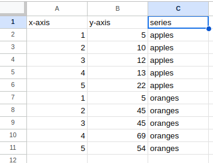

# py-chart-generator

A script to make charts easily from google sheets

## Instructions

1. Arrange your data so it can be copy/pasted into three columns
2. The columns are:
    1. X-Axis
    2. Y-Axis
    3. Series
3. Run chart_generator.py
4. Select "s" for scatter plot or "l" for line plot
5. The graph will be generated in a web browser!

## Example Data

